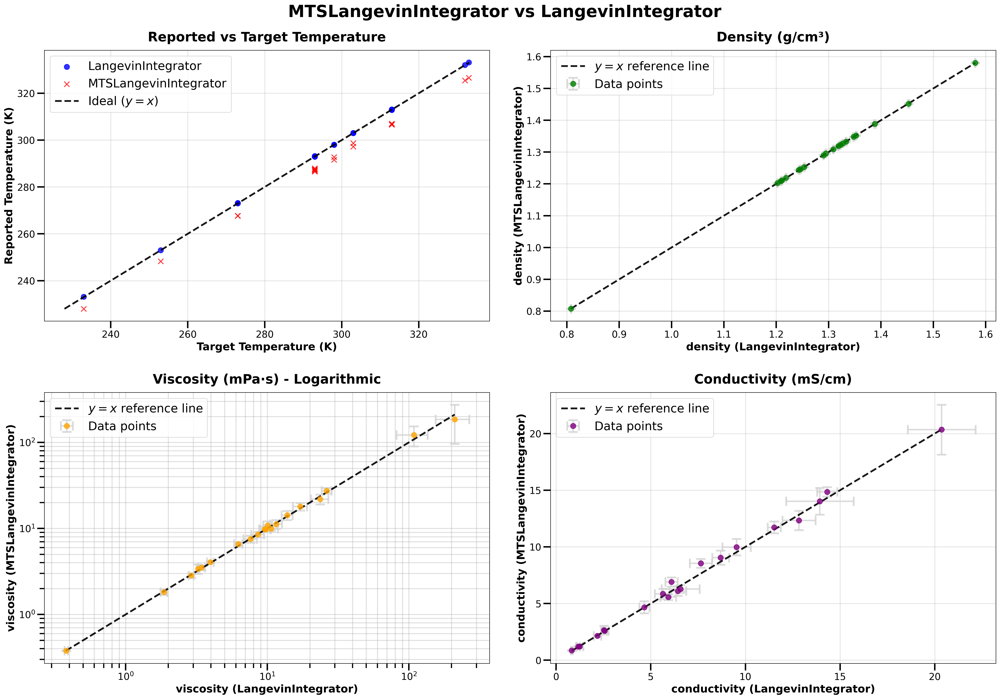

# Example 4: Molecular Dynamics Simulations
This example demonstrates how to perform molecular dynamics (MD) simulations using the ByteFF-Pol force field with OpenMM.

## Overview
The MD simulations example shows how to:
* Run NPT simulations for density calculations
* Run liquid and gas phase simulations to evaluate evaporation enthalpy (Hvap).
* Conduct a simulation to compute transport properties such as viscosity, conductivity and so on.

## How to Run
0. Set PYTHONPATH
```bash
export PYTHONPATH=$(git rev-parse --show-toplevel):${PYTHONPATH}
```
1. Run MD simulations
If you want to run MD simulations for density calculations, run:
```bash
python run_md.py --config density_config.json
```
The config files for other simulations, like evaporation enthalpy (Hvap) and transport properties, are also provided. To run these simulations, simply replace `density_config.json` with the corresponding config file.

## Configuration File Details (*_config.json)

This configuration is used for running transport property simulations (viscosity and conductivity) on electrolyte systems:

* **protocol**: "Transport" - Specifies the simulation protocol type, including `Transport`, `Density` and `HVap`.
* **temperature**: 298 - Simulation temperature in Kelvin
* **natoms**: 10000 - Total number of atoms in the box
* **components**: Molecular composition with **molecule ratio**:
  - **DMC**: 249 
  - **EC**: 170 
  - ...
* **smiles**: SMILES strings for each component.
  - **DMC**: "COC(=O)OC"
  - ...

## Temperature Downshifting Phenomena

Users may notice that the reported equilibrated temperature is lower than the targeted temperature. We confirm that this discrepancy arises simply from temperature being reported at an unphysically low position in the integration cycle, and we ensure that **the thermostat and MD trajectories are accurate**. 

MTSLangevinIntegrator in OpenMM implements the BAOAB-RESPA multiple time step algorithm for constant temperature dynamics. Specifically, its integration sequence proceeds as follows: _velocity_update (half step) -> position_update (half step) -> Langevin_thermal_bath (full step) -> position_update (half step) -> velocity_update (half step) -> reporting_. While the kinetic energy inherently fluctuates during the simulation, the reporting step is positioned between two velocity update substeps, which consistently samples the kinetic energy at the trough of its fluctuation cycle. Consequently, the statistically averaged temperature is downshifted by a factor correlated with the fastest dynamic frequency of the system. Importantly, this downward shift is a purely reporting artifact——**the actual simulation is performed at the target temperature, and the MD trajectories faithfully reflect the thermodynamic state corresponding to the desired temperature**.

For further theoretical details and discussions, please refer to the following references:

* https://arxiv.org/pdf/1304.3269
* https://pubs.aip.org/aip/jcp/article/162/10/104108/3339186/Langevin-integration-for-isothermal-isobaric
* https://github.com/openmm/openmm/issues/2532

To verify the correctness of our MD results, 20 electrolyte formulations were selected and simulated using both MTSLangevinIntegrator and LangevinIntegrator. The integration algorithm in LangevinIntegrator proceeds as: _velocity_update (full step) -> position_update (half step) -> Langevin_thermal_bath (full step) -> position_update (half step) -> reporting_, ensuring accurate temperature reporting. Notably, the two integrators adhere to an identical core integration framework; their only distinction lies in the timing of the reporting step: LangevinIntegrator reports prior to the velocity update, whereas MTSLangevinIntegrator reports midway through the velocity update substeps. Consequently, the MD trajectories generated by the two integrators, as well as the statistical quantities derived from these trajectories, should be nearly indistinguishable.

The results presented below demonstrate that this is indeed the case: the two methods yield nearly identical values for density, viscosity, and conductivity, within the bounds of statistical errors (from 5 parallel runs). This consistency confirms that the apparent temperature deviation observed in MTSLangevinIntegrator is a purely superficial reporting artifact and does not compromise the physical validity of the simulation outcomes.

<div align="center">
  
</div>
